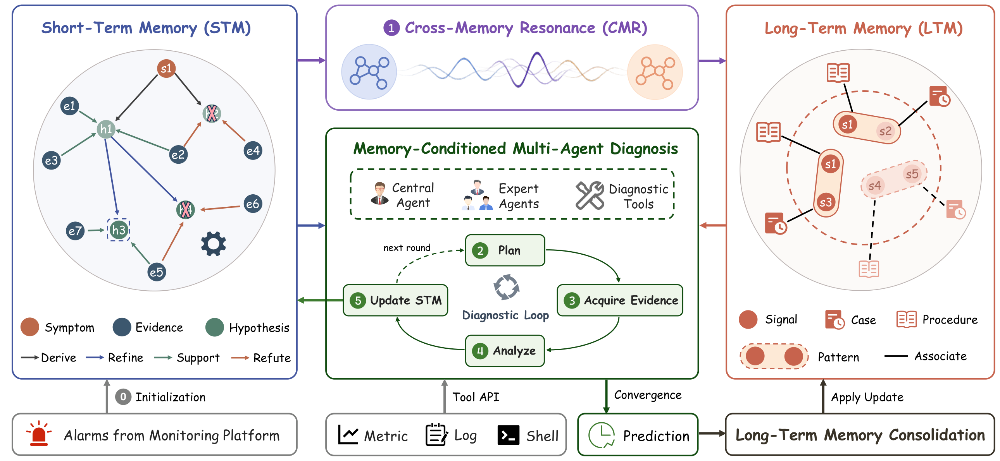

# OpsMem: Dual-Memory Reasoning with Cross-Memory Resonance for Failure Diagnosis

<div align="center">
  <a href="https://arxiv.org/abs/2607.11357"></a>
  <a href="https://github.com/gaorch85/OpsMem/blob/main/LICENSE">  </a>
</div>

<br>

> A dual-memory framework that coordinates multi-agent diagnosis with current diagnostic state and reusable operational experience for reliable failure diagnosis.

## 🎉 News

- [2026-07-06] **OpsMem** code released!

## 🏴 Overview



OpsMem is a dual-memory framework for failure diagnosis. It explicitly represents the current diagnostic state in short-term memory (STM), organizing symptoms, evidence, hypotheses, and their relations during diagnosis, while maintaining long-term memory (LTM) for reusable operational experience, where diagnostic patterns are linked to related procedures and historical cases. At each diagnostic round, cross-memory resonance (CMR) aligns the current STM with the LTM and activates a state-relevant LTM subgraph. Both memories then condition a multi-agent diagnosis loop that plans tasks, acquires evidence, analyzes observations, and updates the STM until convergence. After diagnosis, OpsMem consolidates reusable experience back into the LTM, allowing the system to evolve over time.


## 📦 Code Structure

```text
OpsMem/
  README.md
  LICENSE                   # Apache License 2.0                
  requirements.txt          # Python dependencies
  assets/
    overview.png            # overview figure
  code/
    config.yaml             # configuration
    main.py                 # entry point
    pipeline.py             # orchestration of CMR, diagnosis, and consolidation
    eval.py                 # self-consistent LLM-as-a-Judge evaluation
    datasets/case_1/        # sanitized real-case example
    agents/                 # Central/Expert agents and their LLM action wrappers
    stm/                    # Short-Term Memory that captures the current diagnostic state
    ltm/                    # Long-Term Memory that organizes reusable operational experience
    cmr/                    # Cross-Memory Resonance that aligns STM and LTM
    consolidation/          # Long-Term Memory consolidation
    tools/                  # diagnostic tool interface (metric/log/shell tools)
    prompts/                # prompts
    utils/                  # LLM client, embedding provider, and logging utilities
```

## 🗂️ Dataset and Knowledge Base

The original diagnosis dataset and long-term knowledge base are derived from Huawei operational data and internal troubleshooting experience. Due to confidentiality and compliance restrictions, the full dataset and knowledge base cannot be publicly released.

To make the repository runnable and to illustrate the end-to-end workflow, we provide one sanitized case and a small sanitized seed knowledge base distilled from real data. 

## 🛠 Quick Start

### Create environment

```bash
conda create -n OpsMem python=3.10 -y
conda activate OpsMem
```

### Install dependencies

```bash
pip install -r requirements.txt
```

### Configure LLM

- Edit `code/config.yaml` and set the OpenAI-compatible LLM endpoint under `model.models.default`.

### Configure embedding

- The default embedding provider is defined in `code/utils/embedding.py` (`local_bge_m3` by default). Replace `EMBEDDING_MODEL_NAME_OR_PATH` with your local BGE-M3 model directory. 
- You can also use another local or cloud embedding model by implementing/changing the provider in the same file, as long as its `encode(texts)` method returns an embedding matrix.

### Run example

```bash
cd code
python main.py
```

### Evaluate

```bash
python eval.py --input output/opsmem/answers/default.csv
```


## 🙏 Acknowledgements
OpsMem builds upon [GoS](https://github.com/gaorch85/Graph-of-States), our previous neuro-symbolic reasoning framework for abductive tasks, where an explicit belief state constrains multi-agent reasoning. OpsMem inherits this state-guided reasoning design and extends it into a dual-memory framework for failure diagnosis, where the current diagnostic state and reusable operational experience jointly condition the diagnosis process.


